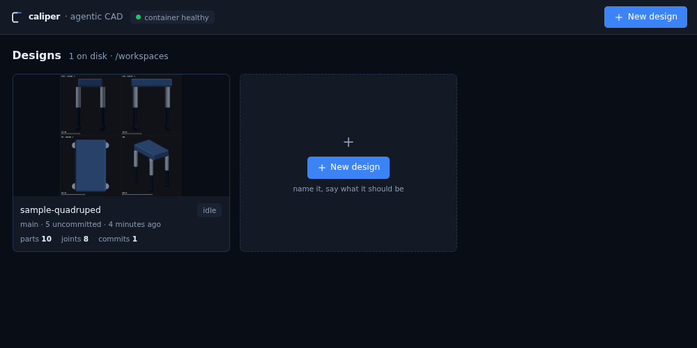
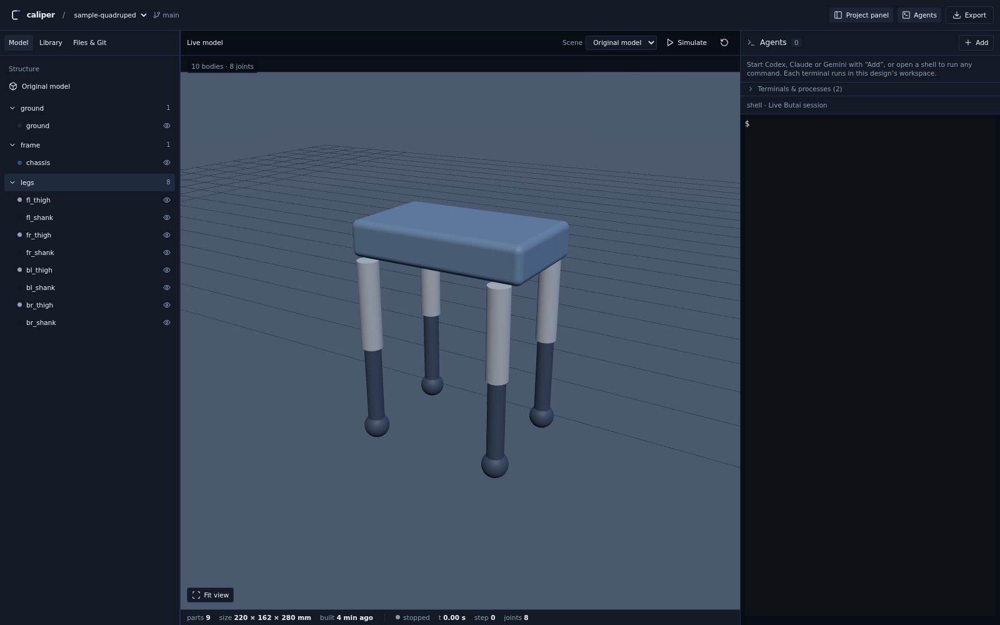
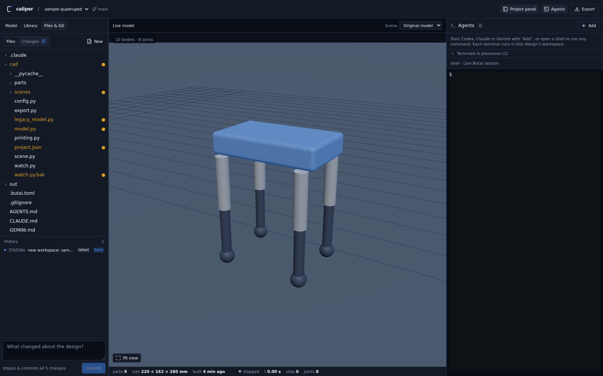
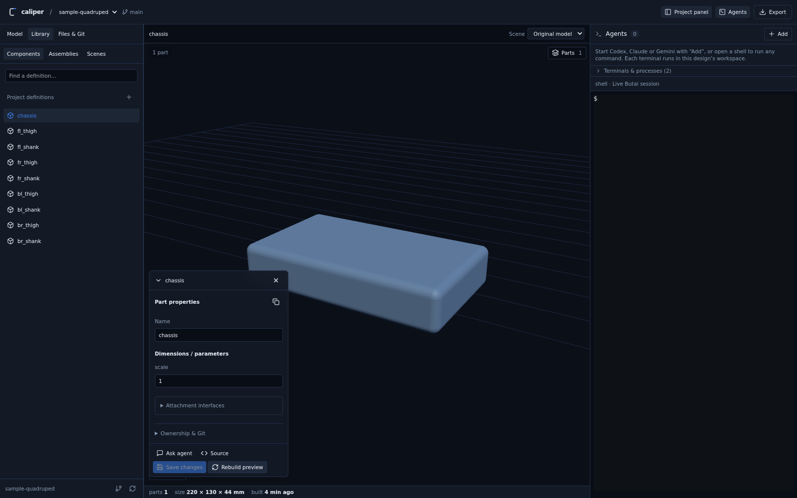
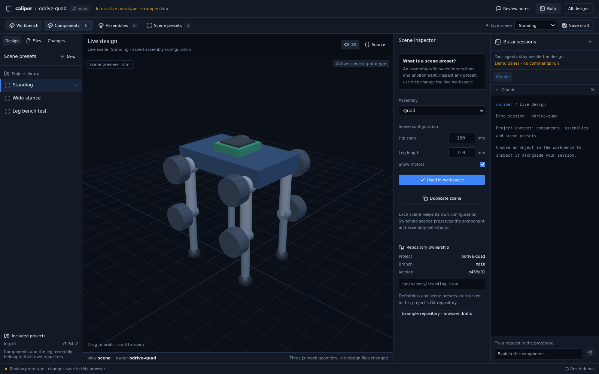

# caliper

**Agentic CAD.** Describe a thing; an agent writes the model as code, and you
watch it take shape — the render, the drawings, the measurements and the physics
— in one page in your browser.


A design in caliper is a Python program built on [build123d](https://github.com/gumyr/build123d),
kept in its own git repository. That is the whole idea. Geometry expressed as
code is geometry an agent can actually reason about, change one dimension of,
and be held to: it can re-export the model, take a section through it, measure
the gap between two parts in millimetres, and run the physics to see whether the
thing stands up. Every one of those answers is a command with output, not an
opinion. And because it is git, every version you liked is a commit you can go
back to.

You get a browser page with the design in a 3D viewport, its files, its history,
and the agent's terminal live beside it — so you can read what it is doing,
type at it, and see the model change while it works.

```
  new design → "a wall bracket for a 60 mm fan, M4 into the wall,
                printable without supports"
             → the agent writes cad/, the watcher re-exports out/,
               the viewport reloads
             → caliper fitcheck / rom / sim  ← the checks it has to pass
             → commit → caliper bundle → STEP · STL · 3MF for your slicer
```

---

## Quick start

```bash
git clone https://github.com/dieterpl/caliper && cd caliper
docker compose up --build          # → http://localhost:8017
```

That is the whole install. The build downloads everything it needs, including
the butai daemon, and there is no configuration step: every setting has a
working default, so a `.env` is optional.

Open the page, press **New design**, give it a name and a sentence — and watch
it get built.

> **About the daemon.** caliper needs **[butai](https://github.com/dieterpl/butai)
> 1.0 or newer** — that release is where its wire protocol settled, and this app
> is written against it. The build installs the current release itself and checks
> the download against the release's `SHA256SUMS`; `BUTAI_VERSION=v1.1.1` in
> `.env` pins one instead. On a machine with no network, or to run a dev build of
> the daemon, hand the build a binary you already have:
>
> ```bash
> BUTAI_BIN=/path/to/butai scripts/fetch-butai.sh
> docker compose up --build
> ```

### What you need

- **Docker** with Compose. Nothing else — no Python, no Node, no CAD kernel on
  your machine; they are all in the image.
- **An agent login, when you want an agent.** The image installs Claude Code,
  Codex and Gemini CLI. Choose a provider when creating a design or use
  **Agents → Add** inside a workspace. You can also create a design
  without starting an agent. Claude uses your mounted `~/.claude`; Codex and
  Gemini logins persist in the `caliper-state` volume.

Use **Add → Shell** to authenticate inside the container:

- Codex: **Add → Sign in to Codex**, then open its link in your browser and
  complete ChatGPT account sign-in. New Codex agents reuse this saved login.
  You can also run `codex login --device-auth` in a shell.
- Gemini: `gemini`, then choose an authentication method in its terminal.
- Claude: `claude`, then follow its sign-in instructions.

Claude and Gemini can alternatively use `ANTHROPIC_API_KEY` or `GEMINI_API_KEY`
in `.env`. Codex uses its own saved account login; Caliper does not supply an
OpenAI API key or replace that login at startup. No credentials are included in
the image.
Installation and authentication commands follow the official
[Codex CLI](https://developers.openai.com/codex/cli),
[Codex authentication](https://developers.openai.com/codex/auth),
[Gemini setup](https://geminicli.com/docs/get-started/), and
[Claude setup](https://code.claude.com/docs/en/setup) documentation.

Provider rows distinguish missing installation from missing configuration.
Older daemons without `/v1/usage` show “Availability unchecked”; a successful
installation check does not establish that your account is signed in.
The design brief is committed in `CLAUDE.md`, `AGENTS.md` and `GEMINI.md`.
After login, ask the agent to build from those instructions; creation does
not wait for or type into a CLI's first-run prompts.

**Add → Run any CLI / command** starts an arbitrary command in a Butai terminal.
For other CLIs with agent status tracking, install the CLI in the runtime
and configure `[[agents]]` in `/state/home/.butai/config.toml`, then restart.
Butai's configured agent array replaces its built-in list, so include every
provider you want. Butai owns each launcher's permission flags and session
restore. Codex currently starts a fresh conversation on daemon restart;
use `codex resume` in a shell to reopen a previous conversation.

### What is running

One container, two processes (`docker/entrypoint.sh`):

- **[butai](https://github.com/dieterpl/butai)**, the daemon that owns every
  workspace, its panes and its agents. caliper's web app is a thin thing in
  front of it — it relays `/butai/api/*` to the daemon verbatim over its Unix
  socket. The agent terminal renders screen snapshots through REST; typing,
  paste and shortcuts use REST input endpoints. The browser uses ordinary HTTP. The file tree, diffs, staging, commits, branches and
  agents you see in the app are all butai's.
- **`web/server.py`**, the only thing listening on a port.

If either dies the container exits and Docker restarts it — a half-running
container that answers HTTP with no daemon behind it is worse than a restart.

Two things are mounted rather than baked in: your `~/.claude`, and
`./workspaces`, which holds your designs and is the one directory worth backing
up.

The CAD toolchain stands on its own, incidentally: `bin/caliper` and every
command it dispatches run against any workspace directory without the daemon or
the container. butai is what turns that toolchain into a multi-design workbench
with agents in it.

## Example designs

Design ideas illustrated by local workspaces include:

- A robot arm.
- Quadruped robots and a separate robot-leg assembly.
- A key holder for an IVAR shelving unit.
- A lamp.

These are examples of what you can create with caliper. Workspace source files,
Git histories, agent conversations and generated exports stay local under
`workspaces/`; they are not included in this repository. Create your own design
from **New design**. The README screenshots show the application and example CAD
geometry.

## Using it

The design gallery opens your workspaces, with a preview and Git status for each.



**New design** asks for a name and a brief — *what should it be?* — and gives
you a folder and a git repository, with an optional agent terminal. The brief
is saved in the workspace instructions for the provider you choose. The
folder is seeded from `template/`: a worked example (a four-legged stander,
because it exercises every part of the DSL) that the agent is told to delete if
you asked for something else.

From there it is a loop, and the loop is what the design is checked by:

- **Save and it rebuilds.** A watcher re-exports `out/` about a quarter second
  after anything under `cad/` changes, and the viewport reloads itself. Nobody
  has to press refresh.
- **Look at it.** `caliper render` writes PNGs — orthographic, sectioned,
  focused on one part. There is no browser inside the container, so this is how
  an agent *sees*, and it is asked to look before it claims anything.

  

  A shaded view cannot show a motor buried in a beam. `caliper render --section
  'y>0'` cuts the design open and puts the cut faces in red:

  
- **Measure it.** `caliper fitcheck` finds parts buried in each other, floating
  apart, or mirrored wrong, and says where in millimetres. `caliper rom` says
  how far each joint really travels before it hits something.
- **Run it.** `caliper sim` puts the design in a headless physics engine — does
  it stand, does it go anywhere — and the viewport has the same engine behind
  **Simulate**, with the clock and step counter running in the strip at the bottom.
  Only meaningful once the design has joints.

  
- **Keep it.** Commit when a change verifies. The app shows the same history and
  can check any commit back out.
- **Hand it over.** `caliper bundle` writes STEP, STL, 3MF and OBJ into
  `out/export/` for a slicer or another CAD program, and tells you if a part is
  not watertight before you find out in the slicer.

### The toolchain

Inside a workspace, one command reaches all of it:

| | |
| --- | --- |
| `caliper export` | rebuild `out/` from `cad/` |
| `caliper watch` | re-export on every save (the app runs this for you) |
| `caliper render` | orthographic PNGs; `--section 'y>0'` to cut, `--focus NAME --persp` for one part |
| `caliper draft` | three-view line drawing — ASCII to read, `--svg` to keep |
| `caliper fitcheck` | clashes, gaps and ±Y symmetry, in mm |
| `caliper rom` | collision-free travel per joint |
| `caliper sim` | headless physics: does it stand, does it walk |
| `caliper clash` · `collide` | pairwise solid overlap · clearance sweep through the range of motion |
| `caliper print` | printable STLs and a manifest |
| `caliper bundle` | STEP/STL/3MF/OBJ of the whole design |

The **Model** panel groups parts as the model declares them. Expand a group
to inspect individual parts or toggle their visibility:



**Joints, motors and physics are optional.** A design that does not move
declares bodies and stops; the app notices and puts the simulation controls
away. Everything above works on a bracket with two parts and no motors.

**Reusable projects and scenes.** A design can own reusable components,
subassemblies and several named scenes in `cad/project.json`. Parents include
subprojects as Git submodules and assemble configured instances with separate
body and joint names. `caliper scenes` lists the scenes;
`caliper export --scene wide --set length=125` builds one configuration.
See [the subproject guide](docs/SUBPROJECTS.md) for the quad/leg examples and
shared motor, controller, pulley and bearing geometry.

For a bracket or another static design, the same workspace omits simulation
controls automatically when `scene.json` has no joints.

**Files & Git** opens the file tree and version history alongside the model and
terminal, so you can inspect the source and keep changes in the design’s repository.



### Project library

The workspace **Library** view (`/#/ws/<name>/project`) lets you inspect
and edit individual subcomponents, compose nested assemblies, configure scenes
and manage the owning project’s Git changes. Older designs can be adopted while
keeping their original model as a scene. See [the project guide](docs/SUBPROJECTS.md).



### Interactive example

Open [the interactive prototype](http://localhost:8017/#/prototype). Explore Components, Assemblies,
Scene presets, Files, Changes and demo Butai panes. **Review notes** keeps your
feedback locally and lets you copy it back into the conversation. Prototype
geometry and sessions are examples; drafts stay in your browser.



The real workspace keeps its files, editor and live Butai terminal when opening
Project library. Scene presets distinguish inspection from **Use in workspace**.
Browsing uses existing geometry: live-model parts isolate immediately, and other
definitions open their saved preview. Browsing never starts a CAD build.
**Save changes** writes files; **Build preview / Rebuild preview** explicitly
generates geometry in the background with visible progress. The last successful
preview stays available across edits and restarts. Physics downloads when
simulation is requested. The workspace session control is named **Agents**.

To repeat the browser checks without launching real agent sessions:

```bash
node scripts/review-ui.mjs
```

Install Playwright locally or globally first; the script also supports the
global `@playwright/test` installation and an explicit
`PLAYWRIGHT_CHROMIUM_EXECUTABLE_PATH`. Screenshots go to `/tmp/caliper-ui-review`.

## How it is put together

```
docker/            the image: butai daemon + web app + CAD toolchain + agent CLIs,
                   and install-butai.sh, which downloads the daemon, checksums
                   it and refuses anything older than butai 1.0 at build time
bin/caliper        the one command an agent inside a workspace uses
tools/             the shared checkers: render, draft, fitcheck, rom, sim, print, bundle
template/          what a new workspace is seeded with (cad/, CLAUDE.md, a skill)
web/               a Vite + React + TypeScript (shadcn/ui) SPA, the Python bridge
                   (server.py), and the vendored protocol and 3D libraries
scripts/           put a local butai binary in the build context; re-shoot docs/images
docs/DESIGN.md     what the app looks like and why — read it before adding UI
workspaces/        your designs. Each is its own git repository; none are ours
```

The repository is the **workbench**, never a design. Nothing in `tools/` may
depend on one model's names or constants — the checkers are shared by every
workspace, so a tool that decided what a foot was by looking for `_lower` in a
part name, or that imported a motor diameter from a config that might not have
one, was a bug both times. The app follows the same rule: a control appears
because the capability is there in `scene.json`, never because of what something
is called.

The browser only ever talks to `web/server.py`, which:

- relays `/butai/api/*` verbatim to the daemon — the file tree, diffs, staging,
  commits, branches, agents and processes are all **the daemon's**;
- serves live agent output and input through the REST proxy; the optional
  `/ws` bridge remains available but is not used by the agent panel;
- owns `/api/workspaces` — what is on disk, creating and removing a design,
  typing at an agent, checking out an old commit, and export;
- serves each design's artifacts under `/w/<slug>/out/...`.

The UI says **design**; the code, the API and the docs say **workspace**
wherever they mean the folder, the git repository, or the butai workspace.

## Access and exposure

The default Docker port binding is `127.0.0.1`: only this machine can reach
Caliper. `WEB_TOKEN` may be empty for localhost use. To enable LAN access, set
both `BIND_ADDR=0.0.0.0` and a strong `WEB_TOKEN` in `.env`. Requests addressed
to a remote hostname or IP are refused without a token.

**Access to Caliper grants command execution and access to mounted agent
credentials.** Use it only with trusted users and trusted CAD projects. For
remote access, put it behind an HTTPS reverse proxy or an SSH tunnel. The
shared token is not a multi-user permission system. See [SECURITY.md](SECURITY.md).

```bash
python3 -c 'import secrets; print(secrets.token_urlsafe(24))'   # into .env
```

Every route goes through the same check, including the artifact routes; the login page is public. If you add one, keep it there.

## Developing on it

Keep the backend and Butai daemon inside the Caliper Docker container. For
quick frontend iteration, run Vite on the host against the container:

```bash
docker compose up --build -d                     # container backend on 8017
cd web
npm install
CALIPER_SERVER=http://localhost:8017 npm run dev  # Vite on 5173
```

Vite proxies the API, artifacts and terminal stream to the container. Caliper
connects exclusively to its own container socket at `/state/butai/butai.sock`.

The automated bar is that the app type-checks and builds, and that the API
answers:

```bash
cd web && npm run build          # tsc --noEmit && vite build → web/dist
curl -s localhost:8017/api/workspaces
```

`CLAUDE.md` has the rest of it, including how to prove the export loop and the
download route's traversal guard without a browser. Note that spawning an agent
starts a real provider session and may cost tokens — do it deliberately, not as a
smoke test.

## Security and release checks

See [SECURITY.md](SECURITY.md) for the trust model and deployment guidance, and
[the release audit](docs/RELEASE_AUDIT.md) for the privacy cleanup and history
limitations. CI runs the frontend build, Python tests, dependency audits and
secret scans, including privacy checks across Git history. Run
`python3 scripts/check-release.py --history` after fetching all branches.
For local Python testing, use Python 3.11 and install the checked
lockfile with `pip install --require-hashes -r requirements.lock`.

### Refresh the screenshots

The UI screenshots above were captured on 2026-09-29 from the current production
build in a disposable Docker stack. The workbench uses the shipped quadruped
template; the redesign image is explicitly a prototype. The command-line render
images illustrate a separate belt-driven robot design.

With Playwright and Chromium installed, point the capture script at a disposable
stack containing an exported `sample-quadruped` design. Adopt it through Library
first to populate the component inspector. Do not use a stack with private designs
or live account sessions: file names, gallery cards and terminal output are visible.

```bash
CALIPER_URL=http://localhost:18017 WS=sample-quadruped node scripts/shoot.mjs
```

The script writes seven UI captures to `docs/images/`, omits host resource status,
and does not create designs or start agents. `OUT` overrides the output directory;
`PLAYWRIGHT_CHROMIUM_EXECUTABLE_PATH` selects an installed Chromium binary.

## License

Apache License 2.0 — see [LICENSE](LICENSE).

Rapier (Apache-2.0) is vendored under `web/vendor/`, along with the Butai
keyboard protocol helpers. Everything else is installed, three.js and build123d included.
Attribution is in [NOTICE](NOTICE).
